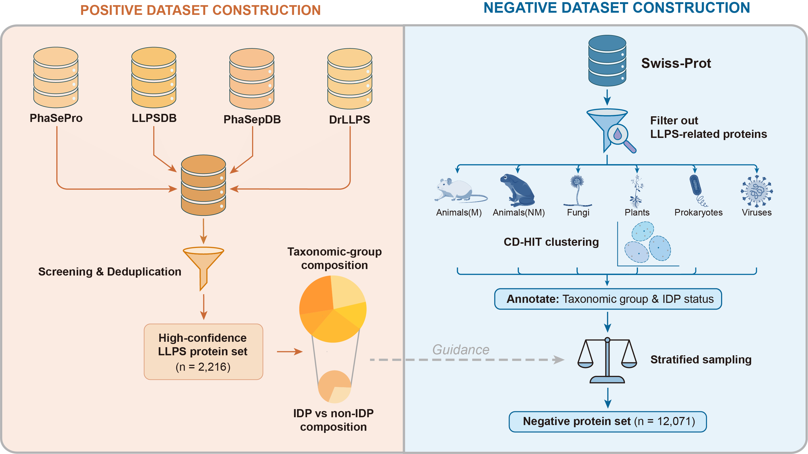

This repository provides benchmark datasets, precomputed sequence features, manuscript figures and tables, and analysis scripts associated with:

> Hou, Shuang, Hexin Shen, and Yong Zhang. **Taxonomy-aware, disorder-matched benchmarking of phase-separating protein predictors.** *bioRxiv* (2026): 2026-02.

Use it to inspect the benchmark lists, reproduce feature calculations and predictor-evaluation logic, or extend analyses with your own score files.

## Contents

| Path | Description |
|------|-------------|
| `benchmark_datasets.csv` | UniProt IDs with taxon, IDP label, and positive/negative class |
| `features/benchmark_sequence_biophysical_features.csv` | Sequence and biophysical features for benchmark proteins |
| `data/` | Data used for benchmark construction |
| `scripts/` | Construction notebook and Python utilities (see below) |
| `figures/` | Main-text figures (`Figure1.png`–`Figure4.png`) |
| `tables/` | Supplementary tables (Excel): benchmark list, predictors, performance summaries |
| `LICENSE` | MIT License |

## Benchmark dataset

Comma-separated file with header: `benchmark_datasets.csv`

| Column | Description |
|--------|-------------|
| `Uniprot ID` | UniProt accession |
| `Taxon` | Taxonomic stratum used for stratification (i.e. Animals(M), Animals(NM), Plants, Fungi, Prokaryotes, Viruses) |
| `IDP Type` | `IDP` or `non-IDP` (intrinsically disordered protein classification) |
| `Label` | `Positive` (phase-separating benchmark positives) or `Negative` |

The construction rationale and filtering steps are summarized under [Dataset construction](#dataset-construction) and in the manuscript.

## Environment and dependencies

**Python scripts** (3.9+ recommended):

```bash
pip install pandas numpy scikit-learn biopython
# Optional but recommended for full features in calculate_sequence_biophysical_features.py:
pip install localcider
```

**External tools** (only if you re-run feature computation from FASTA):

- [AIUPred](https://github.com/Dosztanyi/AIUPred) — binding/anchor output with `-b -g 0`, as expected by `calculate_sequence_biophysical_features.py`
- Per-protein FASTA files named `{uniprot_id}.fasta` in a single directory

**Notebooks:** `positive_dataset_construction.ipynb` and `negative_dataset_construction.ipynb` may require additional packages (e.g. Jupyter, scientific stack, BLASTP, CD-HIT, seqkit). 

## Scripts

### `positive_dataset_construction.ipynb`

Jupyter notebook for the positive benchmark construction workflow (see manuscript for full context).

### `negative_dataset_construction.ipynb`

Jupyter notebook for the negative benchmark construction workflow (see manuscript for full context).

### `calculate_sequence_biophysical_features.py`

Computes IDR- and composition-related features from a UniProt list, per-ID FASTA files, and AIUPred binding output.

```bash
python3 scripts/calculate_sequence_biophysical_features.py \
  --uniprot_list ids.txt \
  --fasta_dir /path/to/fastas \
  --binding_score_txt bindingScore.txt \
  --out_csv feature_matrix.csv \
  --disorder_thr 0.5
```

If `localcider` is not installed, some columns (e.g. IDR κ, Uversky hydropathy) are set to NaN with a warning.

### `predictor_evaluation.py`

Evaluates binary predictors from a scores table with columns including `uniprot`, `tag`, `organism`, `IDP_type`, and one numeric column per model. It performs negative subsampling (default: 10 repeats, seed 42) and reports summary metrics. See the script docstring for optional FLFB/PLAAC CSV formats.

```bash
python3 scripts/predictor_evaluation.py \
  --scores predictor_scores_excludeTraining.csv \
  --output results_summary.csv \
  --organism Plants
```

The default `--scores` filename is an example; you must supply a CSV in that schema (or change `--scores`). Intermediate negative subsample IDs are written to `neg_subsample_uids.csv` in `--work-dir` unless `--neg-csv` is set.

---

## Data sources

The following public databases were used for the construction of benchmark datasets:

- [PhaSePro](https://phasepro.elte.hu/)
- [PhaSepDB](https://db.phasep.pro/)
- [LLPSDB](http://bio-comp.org.cn/llpsdbv2/home.html)
- [DrLLPS](https://llps.biocuckoo.cn/)
- [UniProt](https://www.uniprot.org/)
- [CD-CODE](https://cd-code.org/)
- [BioGRID](https://thebiogrid.org/)

## Dataset construction

Reproducible workflows live in `scripts/positive_dataset_construction.ipynb` and `scripts/negative_dataset_construction.ipynb`. The steps below match the manuscript Methods; see the *bioRxiv* preprint cited at the top for definitions and full rationale.



### Positive dataset construction

- **Sources:** [PhaSePro](https://phasepro.elte.hu/), [PhaSepDB](https://db.phasep.pro/), [LLPSDB](http://bio-comp.org.cn/llpsdbv2/home.html), [DrLLPS](https://llps.biocuckoo.cn/).
- **Sequence filters:** length 50–3,000 aa; exclude sequences containing nonstandard letters `BJOUXZ`.
- **LLPSDB:** exclude the “Ambiguous” subset.
- **DrLLPS:** keep entries with condensate information and tissue/cell annotations; exclude proteins from publications contributing more than ten DrLLPS records (high-throughput annotation risk).
- **Integration:** merge and deduplicate across databases; quantify taxonomy; exclude Protists (insufficient high-confidence positives).
- **Output:** **2,216** high-confidence phase-separating positives.

### Negative dataset construction

- **Candidates:** Swiss-Prot, length 50–3,000 aa.
- **LLPS / condensate contamination:** BLASTP against positives plus [CD-CODE v1](https://cd-code.org/); remove hits with **≥40%** identity and **≥70%** alignment coverage.
- **Predictor training leakage:** remove training positives of all evaluated predictors where available (Droppler excluded—training sets unavailable).
- **Functional proximity:** remove [BioGRID v4.4](https://thebiogrid.org/) first-degree interactors of benchmark positives.
- **Sequence filters:** exclude `BJOUXZ`; assign taxonomic groups; CD-HIT within each group at **0.30** sequence identity.
- **Sampling:** stratify to match positive **taxon × IDP/non-IDP** counts; within each stratum, ESM-2 mean-pooled embeddings and cosine-distance k-center greedy selection for diversity.
- **Output:** **12,071** negatives.

## Supplementary tables

- **Table S1.** List of proteins in benchmark positive and negative sets (Excel; aligns with `benchmark_datasets.csv`).
- **Table S2.** List of evaluated phase-separating protein predictors.
- **Table S3.** Predictor performance across six taxonomic groups in the benchmark dataset.
- **Table S4.** Predictor performance on Animals(M), Fungi, and Plants subsets after training-positive removal and training-similarity filtering.

## Citation

If you use this benchmark or code, please cite the *bioRxiv* preprint (2026-02) above.

## License

Code and documentation in this repository are released under the [MIT License](LICENSE).
